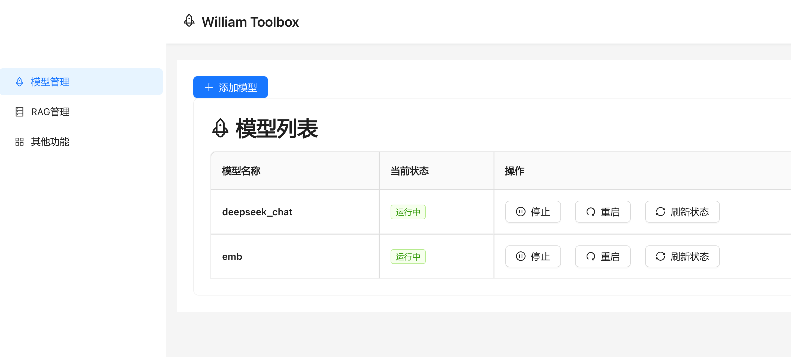

# William Toolbox 🧰

William Toolbox is an open-source project designed to simplify the management of byzerllm models and auto-cder.RAG (Retrieval-Augmented Generation) systems. It provides a user-friendly interface for deploying, monitoring, and controlling various AI models and RAG setups.

This project is powered by [auto-coder.chat](https://auto-coder.chat). You can check how we develop this project by reading yamls in directory `auto-coder-actions`.




## 🌟 Features

- 🤖 Model Management: Deploy, start, stop, and monitor AI models
- 📚 RAG System Management: Create and control RAG setups
- 🖥️ User-friendly Web Interface: Easy-to-use dashboard for all operations
- 🔄 Real-time Status Updates: Monitor the status of your models and RAGs
- 🛠️ Flexible Configuration: Customize model and RAG parameters

## 🚀 Getting Started

### Prerequisites

- Python 3.9+
- Node.js and npm

### Installation

```
pip install williamtoolbox
```

### Running the Application

1. Start the backend server:
   ```
   william.toolbox.backend
   ```

2. Start the frontend server:
   ```
   mkdir web && cd web
   wget https://github.com/allwefantasy/william-toolbox/releases/download/v1.0.0/web.static.tar.gz
   tar -zxvf web.static.tar.gz
   william.toolbox.frontend
   ```

3. Open your browser and navigate to `http://localhost:8006`

## 📖 Usage

1. **Adding a Model**: Click on "Add Model" and fill in the required information.
2. **Managing Models**: Use the model list to start, stop, or check the status of your models.
3. **Creating a RAG**: Click on "Add RAG" and provide the necessary details.
4. **Managing RAGs**: Control and monitor your RAG systems from the RAG list.

## 🤝 Contributing

Contributions are welcome! Please feel free to submit a Pull Request.

## 📄 License

This project is licensed under the MIT License - see the [LICENSE](LICENSE) file for details.

## 🙏 Acknowledgements

- Thanks to all contributors who have helped shape William Toolbox.
- Special thanks to the open-source community for providing the tools and libraries that make this project possible.
